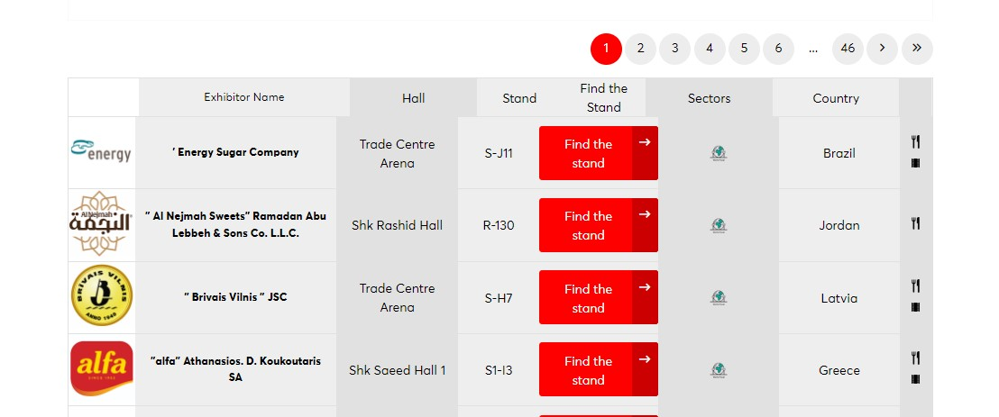

# Welcome to the Web Scraping Data Project Documentation #

## Introduction ##
Welcome to the main page of my web scraping project! If you're reading this, I'm glad that you took your sweet time to go through my work!

## The project layout ##

    .github/
    .vscode/
    app/
        etl/
            extract.py
            transform.py
            load.py
        scripts/
            transformer.py
            web_scraper.py
        main.py
    data/
    docs/
    tests/
        test_webscraping.py
    .gitignore
    .pre-commit-config.yaml
    .python-version
    mkdocs.yml
    poetry.lock
    pyproject.toml
    README.md

## The context ##
Every year, I web scrape data for upcoming food exhibitions. In this case, it is for [Gulfood 2024](https://www.gulfood.com/exhibitors).
Usually, event organizers display a list of exhibitors that, albeit useful, do not serve some purposes. Why?
- Because there are hundreds of exhibitors, the list is **paginated**.
    - This is not a very useful resource if you are going through many exhibitors!
- You rely on a good internet connection, as you need to access each page online.
    - If you are sending people to an international fair, you need to be thoughtful about roaming!
- You cannot filter more than one exhibitor that easily.

In my case, I had to consider the scenario in which the data would be used:
- **The user**: Businessmen, with no IT acumen, that need to know **where to meet specific exhibitors**.
    - They would have limited access to the internet.
    - They need to know beforehand what to discuss with the exhibitors without resorting to notebooks.
    - They need to know the name of the people with whom they need to meet (and not rely on their memory alone).
    - They *may* want to explore some potential business opportunities by looking for countries with the most number of exhibitors by each food sector.
- **The place**: A crowded food exhibition, with lots of people to meet and no time to take notes.
- **The problem**: How track down all clients and partners without relying on the webpage's problematic list while providing annotations and some basic information on the number of exhibitors according to country and sector?

## The solution - The Exhibitor Finder ##
I came up with a **Exhibitor Finder** using **Tableau**, a BI software that offers many solutions within its resources. Although Tableau is often used to produce dashboards and reports, I have noticed in the past that users welcome solutions to problems that they had not necessarily thought before. This is one of the cases. Before, our coworkers had to manually prepare a list of people they would like to meet, together with the main topics of discussion. Considering the aforementioned scenario, this could be tiresome or ineffective.
Now, with this visualization, they can track down where they need to go, as well, as what to discuss and to whom they should talk.

## 1. The Web Scraping ##
Here's an image with the first row of exhibitors as shown on their website:

As we can see, the table consists of the following fields:
- `logo`: The logo of the exhibitor.
- `Exhibitor Name`: The name of the exhibitor.
- `Hall`: The hall(s) in which the exhibitor is located.
- `Stand`: The stand(s) in which the exibitor is located.
- `Find the Stand`: A button that takes the user to an interactive map showing the precise location of the exhibitor.
- `Sectors`: An image that informs the exhibitor's sector in the fair.
- `Country`: The country of origin of the exhibitor.
- `Media Logos`: URLs that provide more textual and/or interactive information on each exhibitor.

We were interested on extracting all but the last field.
### What were some of the challenges? ###
1. **Dynamic content**. No `BeautifulSoup` here - we gotta act like grownups and face the reality that today, static websites are on the low, while everything is dynamically generated! Hence, we summon `selenium` for the job!
2. **Handling a dynamic pagination**. I noticed that the number of pages increased through the days. Iterating through each page required counting beforehand the total number of pages!
3. **Handling exceptions, empty rows, and other unexpected content**. Web scraping is addictive but tiresome! We had to create ways to handle empty rows and other issues such as unrecognized HTML/CSS elements.
4. **Iterating through dozens of pages without crashing your app**. Randomly, the automation would fail or crash. As such, we decided to export each page individually as a .csv file to be concatenated later on.

Fortunately, we could manage to do the whole thing!
## 2. The tests ##
This project was designed **only to improve**. That may sound obvious, but in software development, maintaining quality is very relevant, an often neglected aspect in data projects. As such, we created some tests to make sure that the classes and their respective functions worked properly. We acknowledge that there much more testing could be done, and we expect to develop some more of them in the near future.
Part of these tests were created using the **Test-Driven Development** approach. First, we wrote simple tests **before writing any actual code**. The test will inevitably fail. Then, we wrote **the simplest possible code**. The test should then pass. Later on, we refactor the tests and the code, only then aiming at effectiveness and other issues.

## 3. The transformation ##
Preppin' the data was one of the most challening parts. There were a few difficulties!
### What were some of the challenges? ###
1. **Concatenating the data**.
2. **Getting the categorial names from URLS**.
3. **Splitting and exploding rows**: here, there were some fields - hall and stand - in which sometimes there were *many* values tied together with commas. If ignored, Tableau would read, for instance, `Hall 1, Hall 2` as a single different category. This would affect the user experience and the overall functionality of the product.

## 4. Pre-commits & Continuous Integration ##
Finally, this project also implemented several resources aimed at quality control. The goal here is to create an environment in which any changes in development are not sent straight away to the main repository, therefore potentially affecting the product.
- `pre-commit` hooks were created to prevent us from sending bad code already to the repository. We implemented formatting tools and hooks that avoid the sending of large files.
- **Working on branches**. As a good practice, we tried to develop different part of our product in different branches. `webscraping`, for instance, took care of the earlier stages of the product, while `transformation` implemented the data transformation processes, and so on.
- `CI routines` were implemented too. When pushing branches and making pull requests, we implemented this extra barrier to protect merging the main with bad quality code. Steps such as testing, pre-commit, among others, were used.

## Final thoughts ##
Please, feel free to take a look at my code in the other pages of this documentation. I will make available a Tableau Public version of my visualization, so that you can take a look at the final result. Thank you for your time, and feel free to contact me!

Contact: [felipesebben@yahoo.com.br](mailto:felipesebben@yahoo.com.br)
