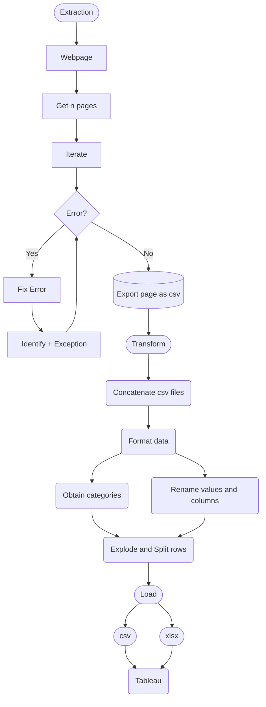

# Project Workflow #

## Introduction ##
This section covers a high-level overview of the project workflow.

## Workflow ##

```mermaid
flowchart TD
    A([Extraction]) --> B[Webpage]
    B --> C[Get n pages]
    C --> D[Iterate]
    D --> E{Error?}
    E -->|No| G[(Export page as csv)]
    E -->|Yes| F[Fix Error]
    F --> H[Identify + Exception]
    H --> E
    G --> I([Transform])
    I --> J(Concatenate csv files)
    J --> K(Format data)
    K --> L(Obtain categories) & M(Rename values and columns)
    L & M --> N(Explode and Split rows)
    N --> R([Load])
    R --> S([csv]) & T([xlsx])
    S & T --> U(Tableau)

```
